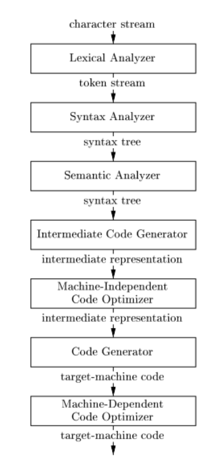
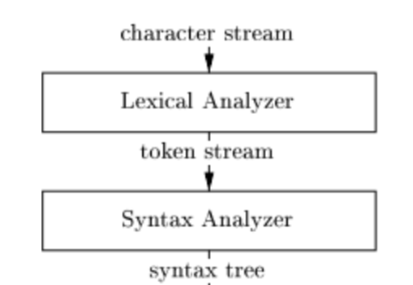

# Writting your own interpreter
*Felipe Vieira*, 2021

---

# is it impossible? / Complexity
We all see interpreters or compilers as this crazy black magic thing created by the gods ages ago. Something impossible to fully understand, with infinite complexity

**We will learn that this is not the case**

it is a bit tricky tho. not gonna lie.

---

# Why bother? / practicallity
It's pretty probable that nobody ever will use your interpreter. But this isn't the point.

We aren't being practical here. We are being **educational**

---
### List of good stuff that you will achieve by writting a interpreter
- Your knowledge of wtf a interpreter does and how langs work / computer science stuff will grow
- You will practice some pretty damn hard algos
- You will (likely) step out your comfort zone
- You will (hopefully) do some mistakes and you will learn from them
- You will be more critical about shitty langs like **JAVA**
- at the end, you could brag about it

---
# The masterplan
1. Get a really IQ20 (easy) lang to interpret. We will be using LISP
2. Grab some lang that you are comfortable with. I started with Rust and had to go back to JS. Shame
3. Write the interpreter (easy, right?)

---
# LISP
> LISP has jokingly been described as **“the most intelligent way to misuse a computer”**. I think that description a great compliment because it transmits the full flavour of liberation: it has assisted a number of our most gifted fellow humans in thinking **previously impossible thoughts.**" - E. W. Dijkstra
---
# Lisp 101
```lisp
(defun factorial (n)
  (if (< n 1)              
      1                           
      (* n (factorial (- n 1)))
    )
) 
```
```c
int factorial(int n) {
    if (n < 1)
        return 1;
    else
        return n * factorial( n - 1 );
}
```
---
# Weird right?
## LISP is for (LIS)t (P)rocessing
literally every line of code is a list. the full program is just a long list of lists. Also, that means that everything is an expression.

---

think about the parentesis as just `[]`
`(+ 1 ( - 2 3)) => ["+", "1", ["-", "2", "3"]]`

This is good. easy to parse.

**Dont forgot this stuff. we will get back to it later**

--- 
# One more thing, Polish notation
polish notation is just putting the **operator first**. this is weird but if you think about it is pretty smart. We don't have to worry about **operator antecedence**.

---

# Examples
` + 1 2 3 => 1 + 2 + 3`
` + 1 * 2 3 => 1 + (2 * 3)`

---

# Interpreters 101
Get ready because this is the real shit 👌

---


---
# Lexical & Syntax Analysis


---
# Lexical Analysis / Tokenizer
our first step here is to split the input program into pieces. What pieces? small pieces. We call this small pieces **tokens**.

It depends a bit on the lang, but normally you want to get symbols like `+=-()[]{}*&,` and words, like `fn, for, return, factorial` keep them small.

---
# code
```js
function tokenizer(text) {
    text = text.split("(").join(' ( ')
    text = text.split(")").join(' ) ')
    return text.split(" ")
}

console.log(tokenizer("(fn (x) (* x x))"))
// [ '(', 'fn', '(', 'x', ')', '(', '*', 'x', 'x', ')', ')' ]
```

---

# Syntax Analysis / Parser
This is where things get complicated **FAST**

We have a lot of little tokens, now we have to actually **find** their **relations** and **meaning**

---

# Parsers 101
Parsers take tokens and converts them into a highly hierarchical data structure. Usually a tree. 

Formaly, we call that trees (A)bstract (S)yntax (T)ree or, **AST**

---

# AST example


---

# AST example, again

code: 
` 2 + 2 `

AST:
```
              +
             / \
            2   2
```

---

# Interesting Stuff:
This is where your favourite lang gets its parentheses, colons, semicolons, (tabs if you are a python nerd) etc... all this only exists to make the implementation of the parser easier/posible.

---

# Pro stuff
A parser is just a implementation of a language **formal grammar** in fact, there are libraries out there that generates entire parsers for you if you specify the grammar correctly. 

Formal grammar is a pretty harsh but incredibly interesting topic. look it at the wiki. Also, is where Noam Chomsky got its reputation. 

--- 
# Getting back to topic
I chose lisp because its parser is terrible easy to do. As lisp is just lists the only thing that the parser needs to do is to build a list of lists.

---
# Code Example
```js
// if a ) is not present it crashes out of memory :)
function parser(tokens) {
    const token = tokens.shift()
    if (token === '(') {
        // start parsing list
        const subTokens = []
        while (tokens[0] !== ')') {
            subTokens.push(parser(tokens))
        }
        tokens.shift() // remove the last )
        return subTokens
    } else if (token === ')') {
        throw new Error("Unexpected )")
    } else {
        return atom(token)
    }
}
```
---

# Results
```js
// input
(fn (x) (* x x)))
// output
[ 'fn', [ 'x' ], [ '*', 'x', 'x' ] ]
```

## Where is my AST?
it may not look like a tree but it really is.

```
        'fn'
        /  \
    ['x']   [ '*', 'x', 'x' ]
       
```

---

# Evaluation
this is where making an interpreter actually differs from building a compiler.
We feed the AST directly to the evaluator and let the computer do its stuff.

---


# Interpreters 101
We need three things for building a interpreter:
1. Code that can actually understand the AST
2. Backing basic functions and operations in native code
3. A environment where we handle variables and functions, AKA: **SCOPES**

--- 
# Expressions vs Statements
Expressions are code that returns something. for example `1 + 1` returns something so is a expression, a `if (1!=1)` dosen't return anything so is a `statement`

On lisp, everything is a expression so that makes our life easier.

---
# Implementing IF
```js
// ast will look like this
// exp = ['if', [cond], [expression], [expression]]
// exp = ['if', ['=', 1, 1], ['print' 'ok'], ['print', 'wtf']]
if (exp[0] === 'if') {
    const [op, cond, a, b] = exp
        if (lispEval(cond, env)) {
            return lispEval(a, env)
    } else {
        return b ? lispEval(b, env) : []
    }
}
```
Wait, what is this `env` variable there?

---

# SCOPES!
that env variable represent a scope in our interpreter. Scopes are the real stuff on interpreters. Garbage collection, all sort of optimizations and stuff happens here. I personally had a lot of fun here. And i didn't do anything fancy here.


---

# Implementing Define
```js
if (exp[0] === 'define') {
    env[exp[1]] = lispEval(exp[2], env)
    return exp[2]
}
```
You can see how we are using our environment (scope) here.

---

# Recursive evaluation
You can see that our functions call `lispEval` everywhere. This is because we don't really know what is the expression that is being evaluated. It could be a single number or 1220 lines of lisp code. By recursively calling eval we end up evaluating everything.

---

# Finally, creating functions
```js
if (exp[0] === 'fn') {
    const [op, params, body] = exp
    return lambda(params, body)
}

function lambda(params, body) {
    return function (args, env) {
        const subEnv = { ...env, ...zip(params, args) }
        return lispEval(body, subEnv)    
    }
}
```

---
# Params and Arguments
todo: explain how you use zip to susbtitute params to arguments on the sub scope created.

---

# TODO
- Backing basic funtions on native code